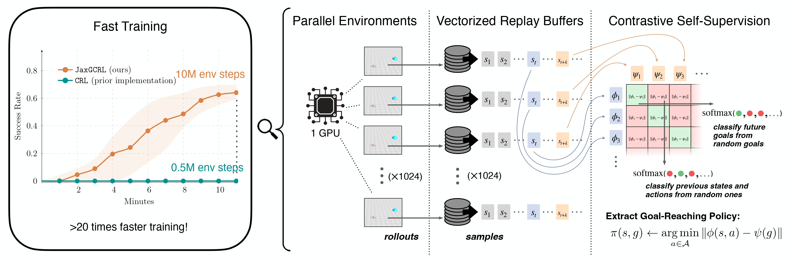
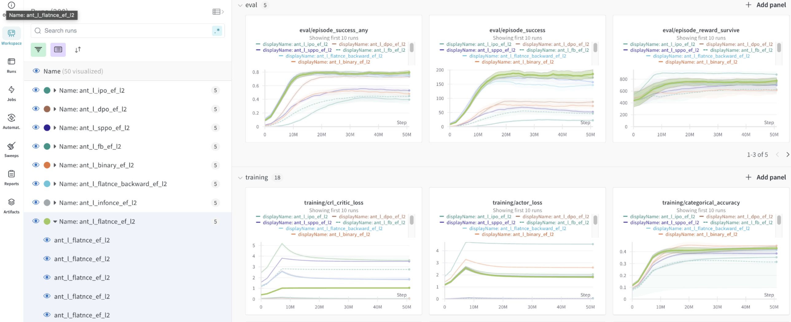

# Accelerating Goal-Conditioned RL Algorithms and Research 


<p align="center"></p>

<p align="center">
Michał Bortkiewicz,  Władek Pałucki,  Vivek Myers,
</p>

<p align="center">
Tadeusz Dziarmaga,  Tomasz Arczewski,
</p>

<p align="center">
Łukasz Kuciński,  Benjamin Eysenbach
</p>


<p style="text-align: center;">
    Paper: <a href="https://arxiv.org/abs/2408.11052" target="_blank">Accelerating Goal-Conditioned RL Algorithms and Research</a>
</p>


**Abstract:** Self-supervision has the potential to transform reinforcement learning (RL),
paralleling the breakthroughs it has enabled in other areas of machine learning. 
While self-supervised learning in other domains aims to find patterns in a fixed dataset, 
self-supervised goal-conditioned reinforcement learning (GCRL) agents discover new behaviors 
by learning from the goals achieved during unstructured interaction with the environment. 
However, these methods have failed to see similar success, both due to a lack of data from 
slow environments as well as a lack of stable algorithms. We take a step toward addressing
both of these issues by releasing a high-performance codebase and benchmark JaxGCRL for self-supervised GCRL,
enabling researchers to train agents for millions of environment steps in minutes on a single GPU.
The key to this performance is a combination of GPU-accelerated environments and a stable, batched version 
of the contrastive reinforcement learning algorithm, based on an infoNCE objective, that effectively makes
use of this increased data throughput. With this approach, we provide a foundation for future research 
in self-supervised GCRL, enabling researchers to quickly iterate on new ideas and evaluate them in a diverse 
set of challenging environments

```
@article{bortkiewicz2024accelerating,
  title   = {Accelerating Goal-Conditioned RL Algorithms and Research},
  author  = {Michał Bortkiewicz and Władek Pałucki and Vivek Myers and Tadeusz Dziarmaga and Tomasz Arczewski and Łukasz Kuciński and Benjamin Eysenbach},
  year    = {2024},
  journal = {arXiv preprint arXiv: 2408.11052}
}
```


## Installation
The entire process of installing the benchmark is just one step using the conda `environment.yml` file.
```bash
conda env create -f environment.yml
```

To check whether installation worked, run a test experiment using `./scripts/train.sh` file:

```bash
chmod +x ./scripts/train.sh; ./scripts/train.sh
```
> [!NOTE]  
> If you haven't configured yet [`wandb`](https://wandb.ai/site), you might be prompted to log in.

## Environment documentation
Information about most environments can be found in the paper, and information about the manipulation environments can be
found in the markdown file in envs/manipulation. See utils.py:create_env for the environment names to specify.

Documentation is somewhat sparse, so when in doubt look at the environment files and XMLs for the exact implementation. We hope 
to improve the docs in the future (please submit a PR if you'd like to help)!

## Contributing
Help us build JaxGCRL into the best possible tool for the GCRL community.
Reach out and start contributing or just add an Issue/PR!

- [x] Add Franka robot arm environments. [Done by SimpleGeometry]
- [ ] Add more complex versions of Ant Sokoban.
- [ ] Get around 70% success rate on Ant Big Maze task.
- [ ] Integrate environments: 
    - [ ] Overcooked 
    - [ ] Hanabi
    - [ ] Rubik's cube
    - [ ] Sokoban


## New CRL implementation and Benchmark
<p align="center">
   
</p>

<p align="center">
Training CRL on Ant environment for 10M steps takes only ~10 minutes on 1 Nvidia V100. 
</p>

We provide 8 blazingly fast goal-conditioned environments based on [MJX](https://mujoco.readthedocs.io/en/stable/mjx.html) and [BRAX](https://github.com/google/brax) and jitted framework for 
quick experimentation with goal-conditioned self-supervised reinforcement learning.  


## Wandb support
All of the metric runs are logged into `wandb`. We recommend using it as a tool for running sweep over hyperparameters.

1. Run exemplary [`sweep`](https://docs.wandb.ai/guides/sweeps):
```bash
wandb sweep --project exemplary_sweep ./scripts/sweep.yml
```
2. Then run wandb agent with :
```
wandb agent <previous_command_output>
```


Besides logging the metrics, we also render final policy to `wandb` artifacts. 

<p align="center">
  
   
</p>

In addition, you can find exemplary plotting utils for data downloaded by `wandb` api in notebooks.

 
## Questions?
If you have any questions, comments, or suggestions, please reach out to Michał Bortkiewicz ([michalbortkiewicz8@gmail.com](michalbortkiewicz8@gmail.com))


## See Also 🙌
There are a number of other libraries which inspired this work, we encourage you to take a look!

JAX-native algorithms:
- [Mava](https://github.com/instadeepai/Mava): JAX implementations of IPPO and MAPPO, two popular MARL algorithms.
- [PureJaxRL](https://github.com/luchris429/purejaxrl): JAX implementation of PPO, and demonstration of end-to-end JAX-based RL training.
- [Minimax](https://github.com/facebookresearch/minimax/): JAX implementations of autocurricula baselines for RL.
- [JaxIRL](https://github.com/FLAIROx/jaxirl?tab=readme-ov-file): JAX implementation of algorithms for inverse reinforcement learning.

JAX-native environments:
- [Gymnax](https://github.com/RobertTLange/gymnax): Implementations of classic RL tasks including classic control, bsuite and MinAtar.
- [Jumanji](https://github.com/instadeepai/jumanji): A diverse set of environments ranging from simple games to NP-hard combinatorial problems.
- [Pgx](https://github.com/sotetsuk/pgx): JAX implementations of classic board games, such as Chess, Go and Shogi.
- [Brax](https://github.com/google/brax): A fully differentiable physics engine written in JAX, features continuous control tasks.
- [XLand-MiniGrid](https://github.com/corl-team/xland-minigrid): Meta-RL gridworld environments inspired by XLand and MiniGrid.
- [Craftax](https://github.com/MichaelTMatthews/Craftax): (Crafter + NetHack) in JAX.
- [JaxMARL](https://github.com/FLAIROx/JaxMARL): Multi-agent RL in Jax.
