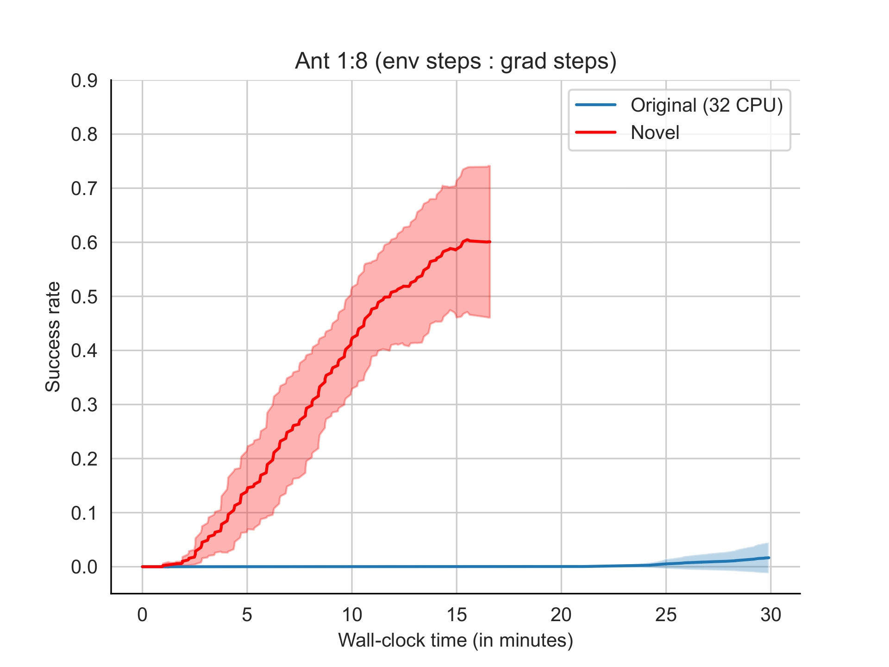
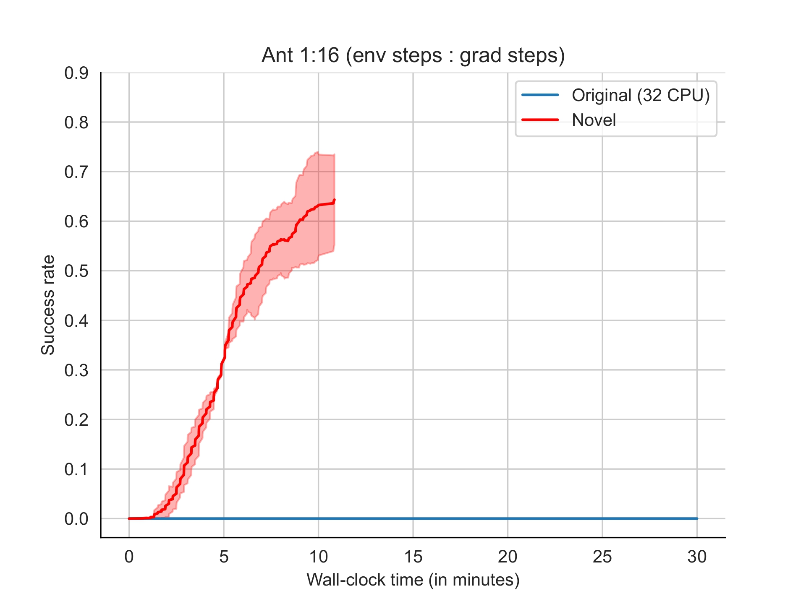

# Accelerating Goal-Conditioned RL Algorithms and Research 


<p align="center"></p>

<p align="center">
Michał Bortkiewicz,  Władek Pałucki,  Vivek Myers,
</p>

<p align="center">
Tadeusz Dziarmaga,  Tomasz Arczewski,
</p>

<p align="center">
Łukasz Kuciński,  Benjamin Eysenbach
</p>


<p style="text-align: center;">
Paper: TODO
</p>

**Abstract:** Self-supervised learning on large-scale internet data has enabled rapid break-
throughs in language modeling. In theory, goal-conditioned reinforcement learning
(GCRL) algorithms can similarly self-supervise, learning from the goals achieved
during unstructured interaction with the environment. However, these methods
have failed to see similar success, both due to computational constraints as well
as a lack of stable algorithms. In this paper, we present a new, high-performance
codebase and benchmark for self-supervised GCRL, enabling researchers to train
agents for millions of environment steps in minutes on a single GPU. The key to
this performance is a combination of GPU-accelerated environments, and a stable,
batched version of contrastive reinforcement learning algorithm based on an in-
foNCE objective that is able to use this increased data throughput effectively. With
this approach, we aim to provide a foundation for future research in self-supervised
GCRL, enabling researchers to quickly iterate on new ideas and evaluate them on a
diverse set of challenging environments.

```
@article{
    TODO
  year={2024}
}
```


## Installation
The entire process of installing the benchmark is just one step using the conda `environment.yml` file.
```bash
conda env create -f environment.yml
```

To check whether installation worked, run a test experiment using `./scripts/train.sh` file:

```bash
chmod +x ./scripts/train.sh; ./scripts/train.sh
```
> [!NOTE]  
> If you haven't configured yet [`wandb`](https://wandb.ai/site), you might be prompted to log in.

## New CRL implementation and Benchmark
<p align="center">
  
   
</p>

<p align="center">
Training CRL on Ant environment for 10M steps lasts ~10 minutes on Nvidia V100. 
</p>

We provide 8 blazingly fast goal-conditioned environments based on [MJX](https://mujoco.readthedocs.io/en/stable/mjx.html) and [BRAX](https://github.com/google/brax) and jitted framework for 
quick experimentation with goal-conditioned self-supervised reinforcement learning.  


## Wandb support
All of the metric runs are logged into `wandb`. We recommend using it as a tool for running sweep over hyperparameters.

1. Run exemplary [`sweep`](https://docs.wandb.ai/guides/sweeps):
```bash
wandb sweep --project exemplary_sweep ./scripts/sweep.yml
```
2. Then run wandb agent with :
```
wandb agent <previous_command_output>
```


Besides logging the metrics, we also render final policy to `wandb` artifacts. 

<p align="center">
  
   
</p>

In addition, you can find exemplary plotting utils for data downloaded by `wandb` api in notebooks.

 
## Questions?
If you have any questions, comments, or suggestions, please reach out to Michał Bortkiewicz ([michalbortkiewicz8@gmail.com](michalbortkiewicz8@gmail.com))