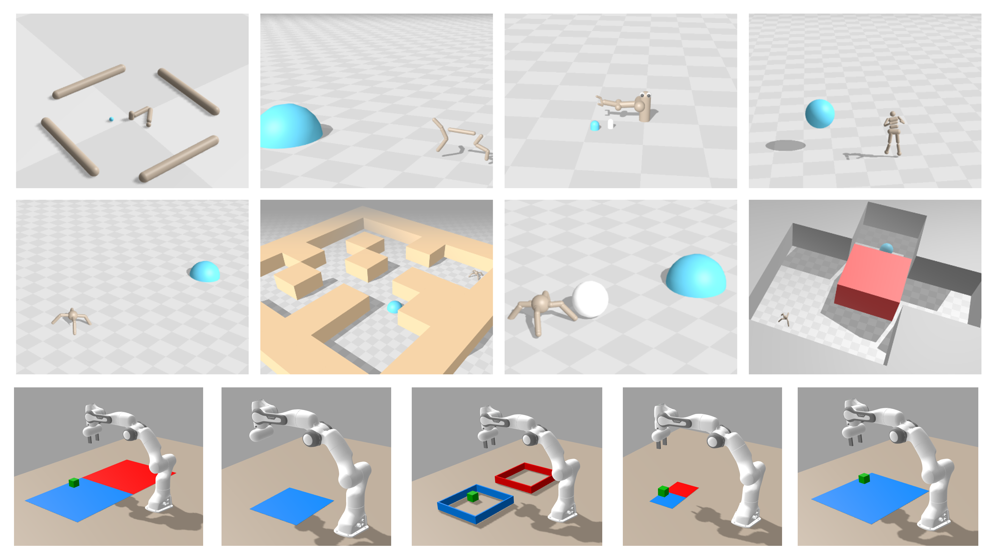

<h1 align="center"> <span style="color: orange;">JaxGCRL</span></h1>


<p align="center">
    <a href= "https://arxiv.org/abs/2408.11052">
        </a>
    <a href= "https://github.com/MichalBortkiewicz/JaxGCRL/blob/master/LICENSE">
        </a>
</p>


<p align="center"></p>


JaxGCRL is a high-performance library and benchmark for self-supervised goal-conditioned reinforcement learning. 
Leveraging efficient GPU acceleration, the framework enables researchers to train agents for millions of environment 
steps within minutes on a single GPU.

- **Blazing Fast Training** - Train 10 million environment steps in 10 
  minutes on a single GPU, up to 22$\times$ faster than prior implementations.
- **Comprehensive Benchmarking** - Includes 10+ diverse environments and multiple pre-implemented baselines for out-of-the-box evaluation.
- **Modular Implementation** - Designed for clarity and scalability, 
  allowing for easy modification of algorithms.


## Installation
The entire process of installing the benchmark is just one step using the conda `environment.yml` file.
```bash
conda env create -f environment.yml
```

To check whether installation worked, run a test experiment using `./scripts/train.sh` file:

```bash
chmod +x ./scripts/train.sh; ./scripts/train.sh
```
> [!NOTE]  
> If you haven't configured yet [`wandb`](https://wandb.ai/site), you might be prompted to log in.

## New CRL implementation and Benchmark
<p align="center">
   
</p>

<p align="center">
Training CRL on Ant environment for 10M steps takes only ~10 minutes on 1 Nvidia V100. 
</p>

We provide 10+ blazingly fast goal-conditioned environments based on [MJX](https://mujoco.readthedocs.io/en/stable/mjx.html) and [BRAX](https://github.com/google/brax) and jitted framework for 
quick experimentation with goal-conditioned self-supervised reinforcement learning.  

## Structure of the Code
The codebase is organized into several key files and directories. Below is an overview of the structure and most important files:

```
├── training.py
├── src 
│ ├── train.py
│ ├── networks.py
│ ├── losses.py
│ └── ...
├── envs
│ └── ...
├── utils.py
└── ...
```
**`training.py`** - The main entry point for running training. It initializes essential components such as the environment, configuration, logging, and starts the training loop.

**`src/train.py`** - Implements the training loop for a GCRL agent.

**`src/networks.py`** - Defines the neural network architectures.

**`src/losses.py`** - Provides customizable loss functions.

**`envs`** - Contains implementations of various environments.

**`utils.py`** - Provides utility functions and classes to support training, including argument parsing, environment creation, configuration management, and metrics logging.

## Experiments
JaxGCRL is highly flexible in terms of parameters, allowing for a wide range of experimental setups. To run a basic experiment, you can start with:
```
python training.py --env_name ant
```
For a complete list of environments, refer to the [environments section](#Environments) or [source code](./utils.py#L104).

One of JaxGCRL's key features is its ability to run parallel environments for data collection. If your GPU has limited memory, you can reduce the number of parallel environments with the following parameter:

```
python training.py --env_name ant --num_envs 16 --batch_size 16
```

To execute multiple experiments, you can use a bash script.
For example, the script below runs experiments to test the performance of different contrastive losses:
```bash
for c_loss in binary infonce flatnce fb dp; do
	for seed in 1 2 3 4 5; do
		python training.py --seed ${seed} \
		--project_name crl --group_name contrastive_loss_experiments \ 
		--exp_name ${c_loss} \
		--contrastive_loss_fn ${c_loss} --energy_fn l2 \
        --log_wandb
	done
done
```

## Environments

This section lists the available environments in the repository, along with the environment names and the corresponding code links

| Environment   |                                Env name                                |                      Code                       |
|:--------------|:----------------------------------------------------------------------:|:-----------------------------------------------:|
| Reacher       |                               `reacher`                                |            [link](./envs/reacher.py)            |
| Half Cheetah  |                               `cheetah`                                |         [link](./envs/half_cheetah.py)          |
| Pusher        |                    `pusher_easy` <br> `pusher_hard`                    |            [link](./envs/pusher.py)             |
| Ant           |                                 `ant`                                  |              [link](./envs/ant.py)              |
| Ant Maze      |        `ant_u_maze` <br> `ant_big_maze` <br> `ant_hardest_maze`        |           [link](./envs/ant_maze.py)            |
| Ant Soccer    |                               `ant_ball`                               |           [link](./envs/ant_ball.py)            |
| Ant Push      |                               `ant_push`                               |           [link](./envs/ant_push.py)            |
| Humanoid      |                               `humanoid`                               |           [link](./envs/humanoid.py)            |
| Humanoid Maze | `humanoid_u_maze` <br> `humanoid_big_maze` <br>`humanoid_hardest_maze` |         [link](./envs/humanoid_maze.py)         |
| Arm Reach     |                              `arm_reach`                               |    [link](./envs/manipulation/arm_reach.py)     |
| Arm Grasp     |                              `arm_grasp`                               |    [link](./envs/manipulation/arm_grasp.py)     |
| Arm Push      |                  `arm_push_easy` <br> `arm_push_hard`                  |  [link](./envs/manipulation/arm_push_easy.py)   |
| Arm Binpick   |             `arm_binpick_easy` <br> `arm_binpickpush_hard`             | [link](./envs/manipulation/arm_binpick_easy.py) |

To add a new environment, register its name in `utils.py` under the `get_env_config` function.

## Wandb support
We highly recommend using Wandb for tracking and visualizing your results ([Wandb support](##wandb-support)). Enable Wandb logging with the `--log_wandb` flag. Additionally, you can organize experiments with the following flags:
- `--project_name`
- `--group_name`
- `--exp_name`

All of the metric runs are logged into `wandb`. We recommend using it as a tool for running sweep over hyperparameters.
Logging to W&B occurs when the `--log_wandb` flag is used when it's not used, metrics are logging to CSV file.

1. Run exemplary [`sweep`](https://docs.wandb.ai/guides/sweeps):
```bash
wandb sweep --project exemplary_sweep ./scripts/sweep.yml
```
2. Then run wandb agent with :
```
wandb agent <previous_command_output>
```


Besides logging the metrics, we also render final policy to `wandb` artifacts. 

<p align="center">
  
   
</p>

In addition, you can find exemplary plotting utils for data downloaded by `wandb` api in notebooks.

## Citing JaxGCRL
If you use JaxGCRL in your work, please cite us as follows:

```
@article{bortkiewicz2024accelerating,
  title   = {Accelerating Goal-Conditioned RL Algorithms and Research},
  author  = {Michał Bortkiewicz and Władek Pałucki and Vivek Myers and Tadeusz Dziarmaga and Tomasz Arczewski and Łukasz Kuciński and Benjamin Eysenbach},
  year    = {2024},
  journal = {arXiv preprint arXiv: 2408.11052}
}
```


## Questions?
If you have any questions, comments, or suggestions, please reach out to Michał Bortkiewicz ([michalbortkiewicz8@gmail.com](michalbortkiewicz8@gmail.com))


## See Also 🙌
There are a number of other libraries which inspired this work, we encourage you to take a look!

JAX-native algorithms:
- [Mava](https://github.com/instadeepai/Mava): JAX implementations of IPPO and MAPPO, two popular MARL algorithms.
- [PureJaxRL](https://github.com/luchris429/purejaxrl): JAX implementation of PPO, and demonstration of end-to-end JAX-based RL training.
- [Minimax](https://github.com/facebookresearch/minimax/): JAX implementations of autocurricula baselines for RL.
- [JaxIRL](https://github.com/FLAIROx/jaxirl?tab=readme-ov-file): JAX implementation of algorithms for inverse reinforcement learning.

JAX-native environments:
- [Gymnax](https://github.com/RobertTLange/gymnax): Implementations of classic RL tasks including classic control, bsuite and MinAtar.
- [Jumanji](https://github.com/instadeepai/jumanji): A diverse set of environments ranging from simple games to NP-hard combinatorial problems.
- [Pgx](https://github.com/sotetsuk/pgx): JAX implementations of classic board games, such as Chess, Go and Shogi.
- [Brax](https://github.com/google/brax): A fully differentiable physics engine written in JAX, features continuous control tasks.
- [XLand-MiniGrid](https://github.com/corl-team/xland-minigrid): Meta-RL gridworld environments inspired by XLand and MiniGrid.
- [Craftax](https://github.com/MichaelTMatthews/Craftax): (Crafter + NetHack) in JAX.
- [JaxMARL](https://github.com/FLAIROx/JaxMARL): Multi-agent RL in Jax.
