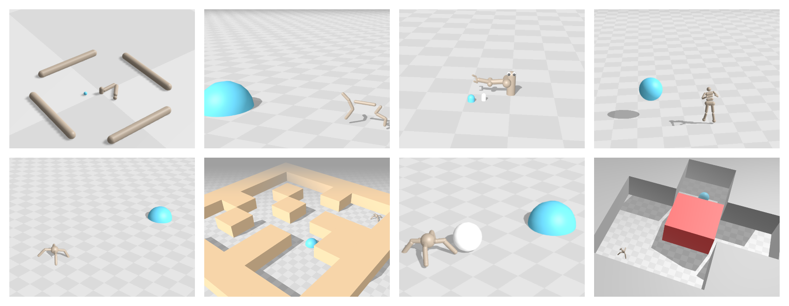
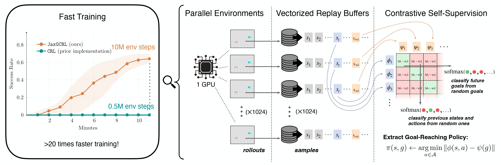

# JaxGCRL

JaxGCRL is a high-performance library and benchmark for self-supervised goal-conditioned reinforcement learning. 
Leveraging efficient GPU acceleration, the framework enables researchers to train agents for millions of environment 
steps within minutes on a single GPU.

- **Blazing Fast Training** - Train 10 million environment steps in 10 
  minutes on a single GPU, up to 22$\times$ faster than prior implementations.
- **Comprehensive Benchmarking** - Includes 10+ diverse environments and multiple pre-implemented baselines for out-of-the-box evaluation.
- **Modular Implementation** - Designed for clarity and scalability, 
  allowing for easy modification of algorithms.

## Structure of the Code
The codebase is organized into several key files and directories. Below is an overview of the structure and most important files:

<pre><code>
├── <b>agents/</b>
│   ├── <b>crl/</b> 
│   │   ├── <b>crl.py</b> CRL algorithm 
│   │   └── <b>networks.py</b> CRL network architectures
│   ├── <b>ppo/</b> 
│   │   └── <b>ppo.py</b> PPO algorithm 
│   ├── <b>sac/</b> 
│   │   ├── <b>sac.py</b> SAC algorithm
│   │   └── <b>networks.py</b> SAC network architectures
│   └── <b>td3/</b> 
│       ├── <b>td3.py</b> TD3 algorithm
│       ├── <b>losses.py</b> TD3 loss functions
│       └── <b>networks.py</b> TD3 network architectures
├── <b>utils/</b>
│   ├── <b>config.py</b>Base run configuration for all agents
│   ├── <b>env.py</b>Logic for rendering and environment initialization
│   ├── <b>replay_buffer.py:</b> Contains replay buffer, including logic for state, action, and goal sampling for training.
│   └── <b>evaluator.py:</b> Runs evaluation and collects metrics.
├── <b>envs/</b>
│   ├── <b>ant.py, humanoid.py, ...:</b> Most environments are here.
│   ├── <b>assets:</b> Contains XMLs for environments.
│   └── <b>manipulation:</b> Contains all manipulation environments.
├── <b>scripts/train.sh:</b> Modify to choose environment and hyperparameters.
└── <b>main.py:</b> Interface file that takes the name of an agent and runs with the specified configs.
</code></pre>

## Paper: Accelerating Goal-Conditioned RL Algorithms and Research

Training CRL on Ant environment for 10M steps takes only ~10 minutes on 1 Nvidia V100. 

**Abstract:** Self-supervision has the potential to transform reinforcement learning (RL), paralleling the breakthroughs it has enabled in other areas of machine learning. While self-supervised learning in other domains aims to find patterns in a fixed dataset, self-supervised goal-conditioned reinforcement learning (GCRL) agents discover new behaviors by learning from the goals achieved during unstructured interaction with the environment. However, these methods have failed to see similar success, both due to a lack of data from slow environment simulations as well as a lack of stable algorithms. We take a step toward addressing both of these issues by releasing a high-performance codebase and benchmark (JaxGCRL) for self-supervised GCRL, enabling researchers to train agents for millions of environment steps in minutes on a single GPU. By utilizing GPU-accelerated replay buffers, environments, and a stable contrastive RL algorithm, we reduce training time by up to $\mathbf{22\times}$ . Additionally, we assess key design choices in contrastive RL, identifying those that most effectively stabilize and enhance training performance. With this approach, we provide a foundation for future research in self-supervised GCRL, enabling researchers to quickly iterate on new ideas and evaluate them in diverse and challenging environments.

