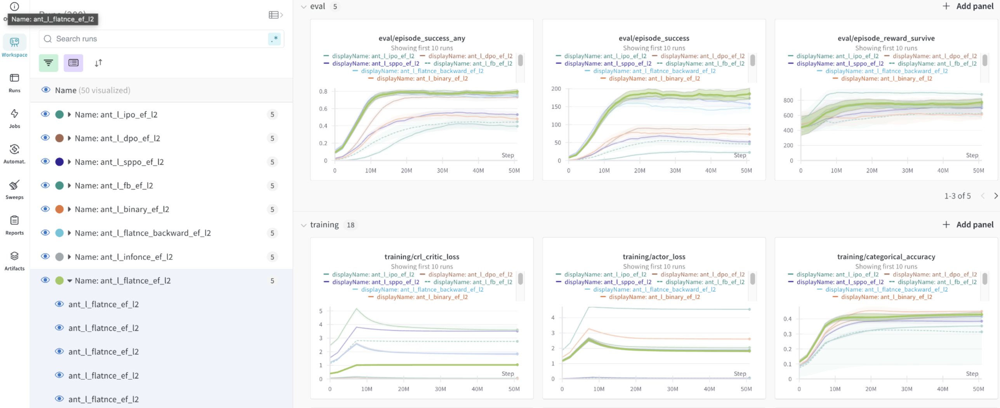

## Experiments
JaxGCRL is highly flexible in terms of parameters, allowing for a wide range of experimental setups. To run a basic experiment, you can start with:
```
python training.py --env_name ant
```
For a complete list of environments, refer to the [environments section](##Environments) or [source code](./utils.py#L66).

One of JaxGCRL's key features is its ability to run parallel environments for data collection. If your GPU has limited memory, you can reduce the number of parallel environments with the following parameter:

```
python training.py --env_name ant --num_envs 16 --batch_size 16
```

!!! note annotate "Replay buffer"
    `num_envs * (episode_length - 1)` must be divisible by `batch_size` due to the way data is stored in replay buffer.

You can customize the neural network architecture by adjusting the number of hidden layers (`n_hidden`), the width of hidden layers (`h_dim`) and the representation dimension (`repr_dim`):
```
python training.py --env_name ant --h_dim 128 --n_hidden 3 --repr_dim 32
```

JaxGCRL supports various built-in energy functions and contrastive loss functions. For example, to use an L2 penalty with the InfoNCE-backward contrastive loss, you can run:
```
python training.py --env_name ant --energy_fn l2 --contrastive_loss_fn infonce_backward
```
For a full list of available energy functions and contrastive losses, see: [ [energy functions](./src/losses.py#L91) | [contrastive losses](./src/losses.py#L145) ]

JaxGCRL offers many other useful parameters, such as `num_timesteps`, `batch_size`, `episode_length`. For a complete list of parameters, their descriptions, and default values, refer to [link](./utils.py#L24).

To execute multiple experiments, you can use a bash script. We highly recommend using Wandb for tracking and visualizing your results ([Wandb support](##wandb-support)). Enable Wandb logging with the `--log_wandb` flag. Additionally, you can organize experiments with the following flags:
- `--project_name`
- `--group_name`
- `--exp_name`


For example, the script below runs experiments to test the performance of different contrastive losses:
```bash
for c_loss in binary infonce flatnce fb dp; do
	for seed in 1 2 3 4 5; do
		python training.py --project_name crl --group_name contrastive_loss_experiments \
		--exp_name c_loss --seed ${seed} --num_timesteps 10000000 --num_evals 50 \
		--batch_size 256 --num_envs 512 --discounting 0.99 --action_repeat 1 \
		--episode_length 1000 --unroll_length 62  --min_replay_size 1000 \
		--max_replay_size 10000 --contrastive_loss_fn ${c_loss} --energy_fn l2 \
		--multiplier_num_sgd_steps 1 --log_wandb
	done
done
```


## Wandb support

!!! note annotate "Wandb account"  
    If you haven't configured yet [`wandb`](https://wandb.ai/site), you might be prompted to log in.


All of the metric runs are logged into `wandb`. We recommend using it as a tool for running sweep over hyperparameters.

1. Run exemplary [`sweep`](https://docs.wandb.ai/guides/sweeps):
```bash
wandb sweep --project exemplary_sweep ./scripts/sweep.yml
```
2. Then run wandb agent with :
```
wandb agent <previous_command_output>
```


Besides logging the metrics, we also render final policy to `wandb` artifacts. 

<p align="center">
  
   
</p>
