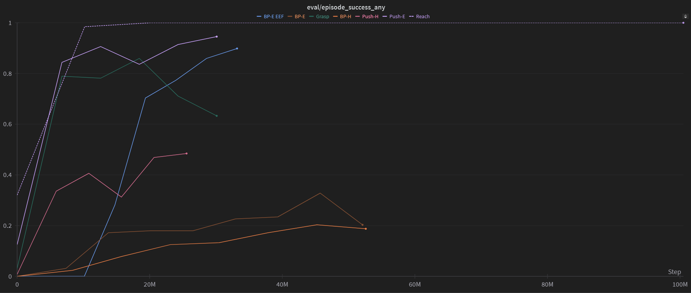

## Available environments
We currently support 4 categories of manipulation tasks: Reach, Grasp, Push, and Binpick. The robot arm is 7DoF (with a gripper if relevant), but only 4 joints are controllable. The action space is absolute joint angle control, which (for better or worse) notably makes it harder than many other robotic arm environments that use absolute or delta end-effector position control.
- Push has easy and hard variants, and binpick has easy, hard, and easy EEF variants (EEF uses just the end-effector hand and rectangular fingers, with delta end-effector position control rather than joint angle control).
- See each docstrings in each environment file for more information.

To use these, you can mostly just specify the environment name as with all the rest, though you may want to adjust the episode length to what is recommended in each of the environment files (self.episode_length).

## FAQ
Q: What's going on with the "RuntimeWarning: overflow encountered in cast"?

A: While it's not 100% clear, it seems benign and doesn't seem to hurt either environment stability or training performance. It seems correlated with the number of bodies that are permitted to collide with each other, or may be caused by two objects colliding initially when they shouldn't be. Some effort was expended to fix this, to no success. If you know why or know how to fix it, please let us know!

## Difficulty of environments
Below is a rough approximation of how difficult each task is (BP is binpick, E is easy, H is hard). Caveats and settings below. It'd be helpful at some point for us (or anyone else) to rerun with standard settings on up-to-date versions of the environment.
- Settings used for all other than reach and BP-E EEF (these settings may not be optimal): [256, 256] hidden layers, with layernorm, min replay size 100, max replay size 10k, unroll length = episode length, batch size 128, multiplier_num_sgd_steps = 64. **Most notably, the update to data ratio (UTD) is 1:2, rather than 1:16 by default -- it often takes a lot of gradient steps to get good performance.** All other settings are default. These environments are slightly outdated (roughly half episode length, and slightly harder for various reasons; BP-E is probably much easier in the up-to-date version since it only has one goal instead of an area of potential goals).
- For reach, same as above, but batch size 256 and multiplier_num_sgd_steps = 16, for UTD 1:16. Slightly outdated as well.
- For BP-E EEF, same as above, but batch size is 256 and multiplier_num_sgd_steps = 64, for UTD 1:4. Up-to-date.

The order of difficulty is roughly reach < push-easy < grasp < binpick-easy EEF < push-hard < binpick-easy < binpick-hard. Maybe binpick-easy < push-hard with the new goal changes.

   

